# 👋 Hi, I'm Braxton Geary!

Welcome to my GitHub profile! I'm a Computer Science researcher, developer, and lifelong learner passionate about **Artificial Intelligence**, **Reinforcement Learning**, and **Multi-Agent Systems**. My work often involves exploring how agents can collaborate and make decisions under uncertainty, leveraging cutting-edge techniques in AI and machine learning.

---

## 📜 Table of Contents
1. [About Me](#about-me)
2. [Past Contributions](#past-contributions)
3. [Current Goals](#current-goals)
4. [Tech Stack](#tech-stack)
5. [Contact Me](#contact-me)

---

<h2 id="about-me">🔍 About Me</h2>
Hi! I’m Braxton Geary, a Computer Science researcher passionate about advancing **Artificial Intelligence** and **Reinforcement Learning**. My work focuses on creating intelligent systems that make decisions under uncertainty, with applications in robotics, multi-agent systems, and energy-efficient transportation.  

I’m currently completing my **MS in Computer Science** at Utah State University and applying to PhD programs, where I hope to deepen my research in decision-making algorithms and multi-agent collaboration. I’m always eager to collaborate on innovative projects that push the boundaries of AI and its real-world impact.

I love learning and trying new things!  Several months ago I switched to Linux (Ubuntu) because a certain OS deleted all my college notes and I wanted to learn more about computers.  At the beginning of this year (2025), I switched from Ubuntu to Arch Linux to dive further into the nitty-gritty of what goes on in a computer. I've loved it and don't plan on going back anytime soon!  As an added perk, I can now use the holy mantra of all Arch users ("BTW, I use Arch")

---

<h2 id="past-contributions">🔗 Past Contributions</h2>
I’ve collaborated on impactful projects across diverse domains. Here are some highlights:

### 1. [**DelayRL-PCSE**](https://github.com/gavinedd/DelayRL-PCSE)
- Developed a **reinforcement learning framework** to model decision-making under delayed feedback in farming scenarios. This project explores how farmers can share information to optimize resource use.

### 2. [**RoboticInstructionLLM**](https://github.com/Isaacwilliam4/RoboticInstructionLLM)
- Contributed to research on **large language models (LLMs)** for robotic instruction, helping bridge the gap between human intent and machine actions.

### 3. [**Spot Robot Fun**](https://github.com/USUBadBatch/5510-spot)
- Part of a team building control systems and applications for **Boston Dynamics Spot**, focusing on practical robotics applications.

---

<h2 id="current-goals">🌟 Current Goals</h2>
- **PhD Research**: Advancing the field of **multi-agent reinforcement learning**, with a focus on collaboration, decision-making under uncertainty, and scalability in complex environments.
- **AI for Real-World Impact**: Exploring applications of reinforcement learning and AI in robotics, intelligent transportation, and energy systems to solve pressing challenges.
- **Open Source Contributions**: Engaging with the AI and ML communities through contributions to open-source projects and research tools.

---

<h2 id="tech-stack">🛠️ Tech Stack</h2>

<td style="border: none;">
width="80" style="background-color: white; border-radius: 8px;" style="background-color: white; border-radius: 8px;"

- **Programming Languages**
  - Python
  - TypeScript
  - JavaScript
  - Java
  - C++
  <table style="border-collapse: collapse; border: none;">
    <tr>
      <td style="border: none;"></td>
      <td style="border: none;"></td>
      <td style="border: none;"></td>
      <td style="border: none;">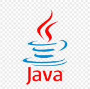</td>
      <td style="border: none;">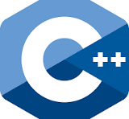</td>
    </tr>
  </table>

- **Frameworks**
  - React
  - Django
  - Flask
  - Selenium
  <table style="border-collapse: collapse; border: none;">
    <tr>
      <td style="border: none;"></td>
      <td style="border: none;"></td>
      <td style="border: none;"></td>
      <td style="border: none;"></td>
    </tr>
  </table>

- **Libraries**
  - PyTorch
  - Tensorflow
  - Scikit-learn
  - NumPy
  - pandas
  - SciPy
  - OpenAI Gym
  - Google DeepMind Control
  - Stable Baselines3
  - Matplotlib
  - Plotly
  - NLTK
  <table style="border-collapse: collapse; border: none;">
    <tr>
      <td style="border: none;"></td>
      <td style="border: none;"></td>
      <td style="border: none;">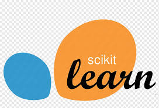</td>
      <td style="border: none;"></td>
    </tr>
    <tr>
      <td style="border: none;"></td>
      <td style="border: none;"></td>
      <td style="border: none;">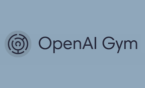</td>
      <td style="border: none;"></td>
    </tr>
<tr>
      <td style="border: none;">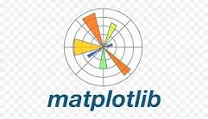</td>
      <td style="border: none;"></td>
    </tr>

  </table>

- **Tools & Platforms**
  - GitHub/GitLab
  - Docker/Docker-Compose
  - Jupyter Notebooks
  - Overleaf
  <table style="border-collapse: collapse; border: none;">
    <tr>
      <td style="border: none;">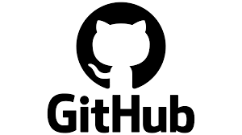</td>
      <td style="border: none;"></td>
      <td style="border: none;">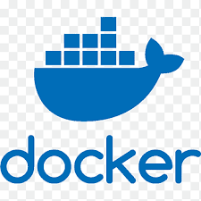</td>
      <td style="border: none;">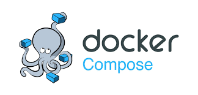</td>
    </tr>
    <tr>
      <td style="border: none;"></td>
      <td style="border: none;"></td>
    </tr>
  </table>

- **Cloud & Infrastructure**
  - AWS
  - Nginx
  - Traefik
  <table style="border-collapse: collapse; border: none;">
    <tr>
      <td style="border: none;"></td>
      <td style="border: none;"></td>
      <td style="border: none;">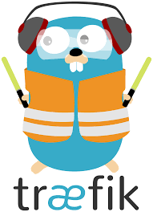</td>
    </tr>
  </table>

- **Operating Systems**
  - Arch Linux (Current Daily Driver OS)
  - Ubuntu (Server & Desktop)
  - Windows
  - MacOS
  <table style="border-collapse: collapse; border: none;">
    <tr>
      <td style="border: none;">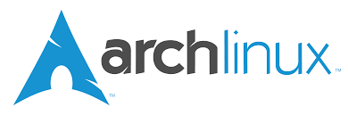</td>
      <td style="border: none;">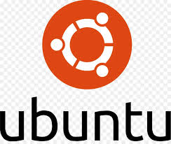</td>
      <td style="border: none;">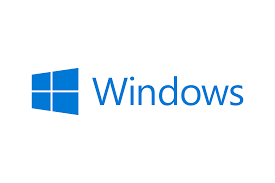</td>
      <td style="border: none;">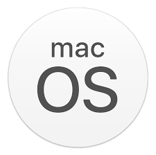</td>
    </tr>
  </table>

- **Databases**
  - PostgreSQL
  - SQLite
  - MySQL
  - MongoDB
  <table style="border-collapse: collapse; border: none;">
    <tr>
      <td style="border: none;">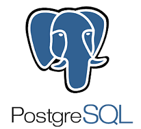</td>
      <td style="border: none;"></td>
      <td style="border: none;"></td>
      <td style="border: none;"></td>
    </tr>
  </table>

- **Other**
  - GraphQL
  - REST
  <table style="border-collapse: collapse; border: none;">
    <tr>
      <td style="border: none;">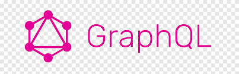</td>
    </tr>
  </table>

---

<h2 id="contact-me">📬 Contact Me</h2>
I’m always looking to collaborate with like-minded researchers and developers. Feel free to reach out if you’re interested in:
- Reinforcement learning
- Multi-agent systems
- AI applications in robotics and transportation

Here’s where you can find me:
- **LinkedIn**: [linkedin.com/in/braxton-geary](https://linkedin.com/in/braxton-geary)
- **Personal Website**: Coming Soon 🚀

Thanks for stopping by!
